# GAN Colorize cifar10

#### Implementation for Gan network Colorize

#### Using cifar10 dataset only in code

#### Colorspace Convert(RGB->LAB, LAB->RGB)

# Sample Image every 10 epochs

## 0 Epoch

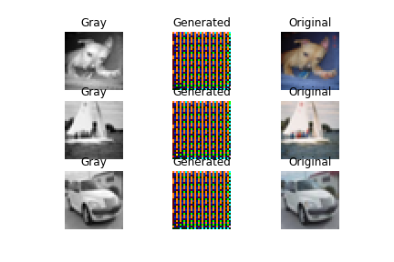

## 10 Epoch

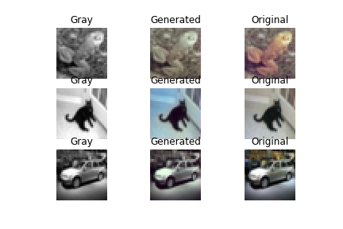

## 20 Epoch

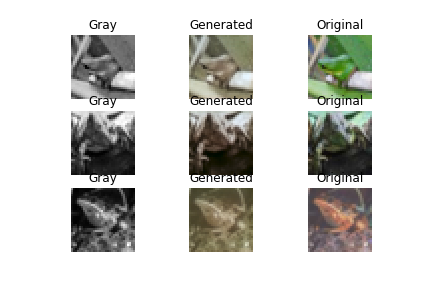

## 30 Epoch

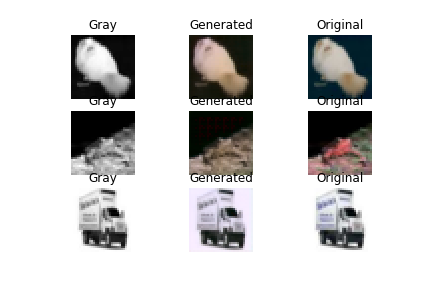

## 40 Epoch

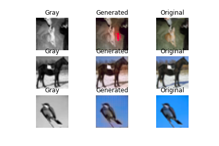

## 50 Epoch

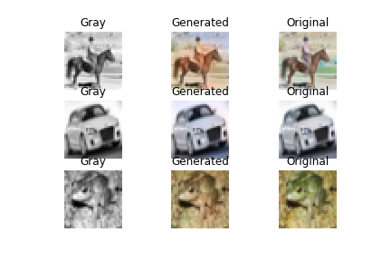

## 60 Epoch

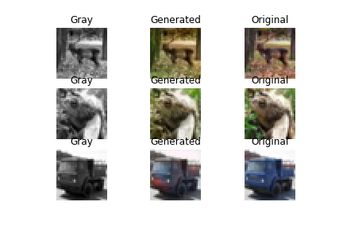

## 70 Epoch

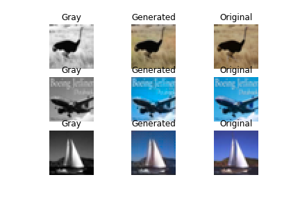

## 80 Epoch

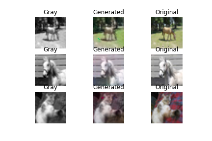

## 90 Epoch

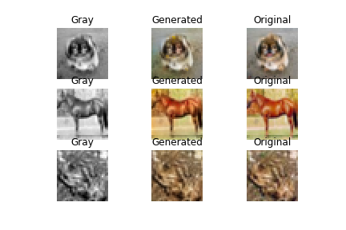

## 100 Epoch

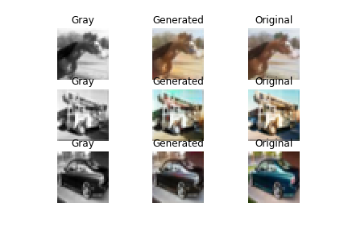

## 110 Epoch

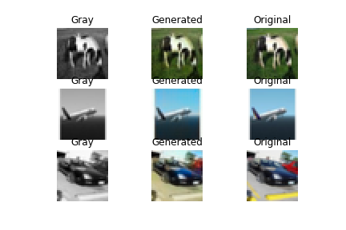

## 120 Epoch

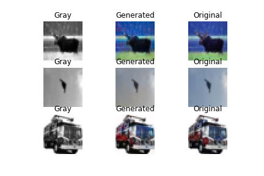

## 130 Epoch

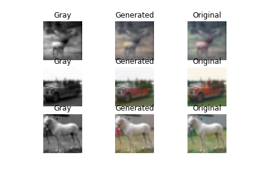

## 140 Epoch

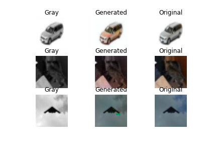
